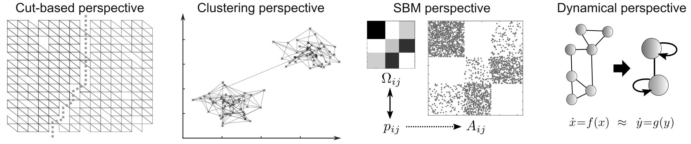
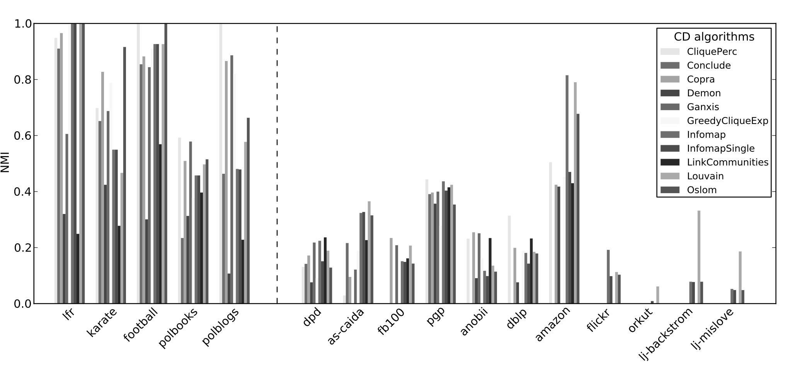
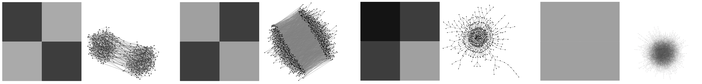

###### Introduction to Network Analysis 2021/22 (viii)

## Network community detection, graph partitioning

You are given four small social networks with known sociological partitioning of nodes.

+ [Zachary karate club network](http://lovro.fri.uni-lj.si/ina/nets/karate_club.net) (2 groups)
+ [Davis southern women network](http://lovro.fri.uni-lj.si/ina/nets/southern_women.net) (3 groups)
+ [Lusseau bottlenose dolphins network](http://lovro.fri.uni-lj.si/ina/nets/dolphins.net) (2 groups)
+ [US college football network](http://lovro.fri.uni-lj.si/ina/nets/american_football.net) (12 conferences)

Later, you will be studying also four larger networks with some metadata associated with each node.

+ [Java class dependency network](http://lovro.fri.uni-lj.si/ina/nets/cdn_java.net) (54 packages)
+ [US college Facebook social network](http://lovro.fri.uni-lj.si/ina/nets/dormitory.net) (66 dormitories)
+ [WikiLeaks cable reference network](http://lovro.fri.uni-lj.si/ina/nets/wikileaks.net) (246 embassies)
+ [YouTube users social network](http://lovro.fri.uni-lj.si/ina/nets/youtube.net) (12,295 groups)

All networks are in Pajek format, whereas edge list and LNA formats are also available.

Browse [CDlib](https://cdlib.readthedocs.io/en/latest/), [NetworkX](https://networkx.org/documentation/stable/reference/algorithms/community.html), [graph-tool](https://graph-tool.skewed.de/static/doc/demos/inference/inference.html) or other library for implementations of network community detection and graph partitioning algorithms. Select an algorithm which you will be using in the exercises below. For instance, select one of popular algorithms like hierarchical optimization of modularity known as Louvain algorithm, map equation algorithm called Infomap, simple label propagation algorithm, hierarchical clustering based on edge betweenness, (degree-corrected) stochastic block models etc.
	

### I. Small networks with known partitioning

**(code)** Apply the algorithm to small social networks above and test whether the revealed communities coincide with sociological partitioning of these networks. You should apply the algorithm to each network multiple times and compare partitions using some standard measure like normalized mutual information or adjusted Rand index. Since these networks are very small, you could also print out or visualize the results.

### II. Larger networks with node metadata

**(code)** Apply the algorithm to larger networks above and test whether the revealed communities coincide with metadata associated with the nodes of these networks. You should apply the algorithm to each network a couple of times and compare partitions using some standard measure.

### III. Synthetic graphs with planted partition

**(code)** Apply the algorithm to some synthetic graphs with planted partition and test whether the revealed communities coincide with planted group structure. You should apply the algorithm to graphs with varying mixing parameter $\mu$ and compare partitions using some standard measure. For which values of $\mu$ does the algorithm reveal the planted partition?

### IV. Random graphs with no structure

**(code)** Apply the algorithm also to Erd&ouml;s-R&eacute;nyi random graphs that have no group structure and test whether the algorithm is able to detect this. You should apply the algorithm to random graphs with increasing average degree $\langle k\rangle$ and compare partitions using some simple statistic. For which values of $\langle k\rangle$ does the algorithm reveal the correct partition?

