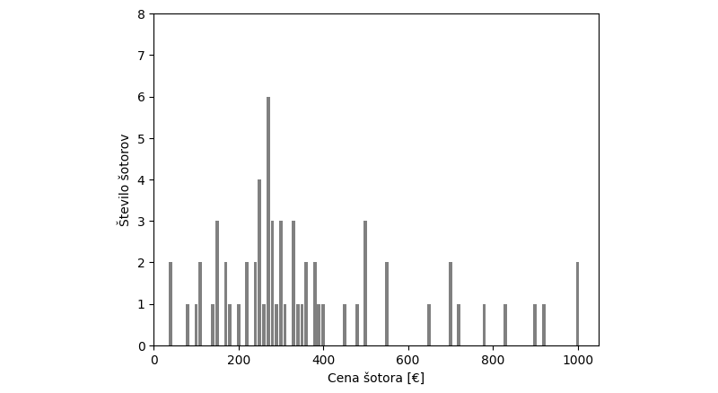
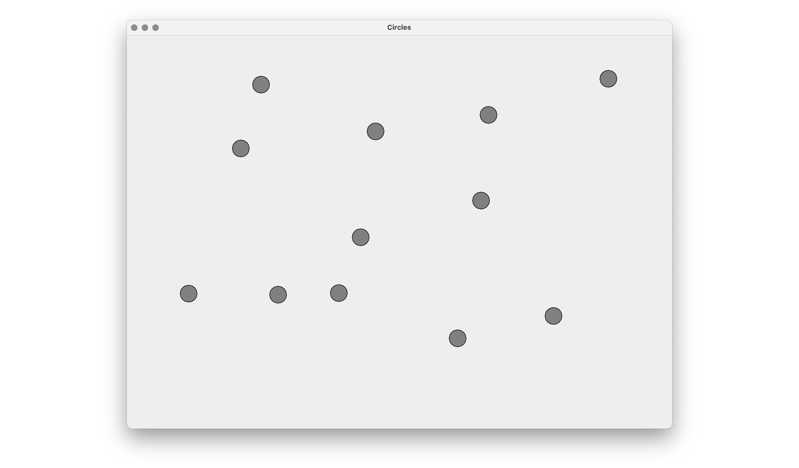

###### _Četrtek 24. 6. 2021 ob 9:00 na daljavo preko Zoom_

## 1. pisni izpit pri Programiranje 2 (Praktična matematika)

Čas reševanja pisnega izpita je **120 minut**. Pisni izpit rešujete na lastnih računalnikih doma, dočim pa morate biti celoten čas izpita **vidni preko kamere**! Dovoljena je uporaba poljubnega gradiva, literature, spletnih virov ter zapiskov in rešitev iz predavanj ali vaj. **Prepovedana je kakršnakoli komunikacija** v realnem času!

Pisni izpit je sestavljen iz **štirih enakovrednih nalog**. Prvi dve nalogi zahtevata rešitev v **programskem jeziku [Python 3](https://www.python.org/downloads/release/python-370/)**, zadnji dve nalogi pa zahteva rešitev v **programskem jeziku [Java 8](https://www.oracle.com/technetwork/java/javase/overview/java8-2100321.html)**. Sestavljeni programi ne smejo uporabljati modulov, ki niso skladni s programskim jezikom Python 3, oziroma knjižnic, ki niso del programskega jezika Java 8.

Vso **gradivo potrebno za reševanje nalog** je dostopno na [spletni učilnici](https://ucilnica.fmf.uni-lj.si/course/view.php?id=130). Sestavljene **programe oddate na spletni učilnici** kot je zavedeno v razdelkih <span style="color:gray">_**Kaj in kako oddam?**_</span>. Pazite, da se natančno držite navodil oddaje! 

-

### 1. Največja števila brez urejanja ($\approx$15 vrstic Python kode)

V programskem jeziku Python 3 sestavite program, ki naj najprej **ustvari seznam milijon naključno izbranih celih števil** iz intervala $[0,10^{12}]$. Števila v seznamu naj bodo enolična (tj. vsako število se lahko pojavi kvečjemu enkrat). 

Nato na zaslon **izpišite osem največjih sodih števil** v seznamu, pri čimer pa *ne smete uporabiti urejanja* (npr. funkciji `sort` ali `sorted`)! Števila v izpisu naj bodo urejena padajoče (tj. prvo v izpisu naj bo največje sodo število).

Primer izpisa sestavljenega programa je prikazan spodaj.

```bash
999999873322
999999002246
999997435912
999995076392
999994842130
999993110474
999991177744
999989302520
```

###### _Kaj in kako oddam?_

Sestavljen program shranite v **datoteko** `numbers.py`, ki jo **oddate na** [spletni učilnici](https://ucilnica.fmf.uni-lj.si/course/view.php?id=130). Ne pričakuje se, da je programska koda opremljena s komentarji. Pazite pa, da program ne vsebuje napak, kar pomeni, da se ukaz `python numbers.py` uspešno izvede!

-

### 2. Cene šotorov v Iglu Šport ($\approx$20 vrstic Python kode)

Na spletni strani trgovine [Iglu Šport](https://www.iglusport.si) so vidne **cene šotorov za taborjenje**. S pomočjo spodnjega programa v programskem jeziku Python 3 najprej **preberite podatke spletne strani** v formatu HTML.

```py
import requests
html = requests.get("https://www.iglusport.si/taborjenje/sotori/sotori").text
```

Vaša naloga je, da iz vsebine spletne strani najprej **izluščite cene prikazanih šotorov**. Le-te se na spletni strani pojavijo kot npr. `<span class="price">30,99 €</span>`, pri čimer je 30,99 € cena šotora. (Predlaga se, da s pomočjo regularnih izrazov izluščite nize znakov oblike `<span class="price">30,99` in nato iz najdenih nizov izluščite cene šotorov.)

Nato z uporabo modula `matplotlib.pyplot` **izrišite histogram, ki prikazuje porazdelitev cen šotorov**. Za namene jasnejše predstave, pri izrisu histograma cene šotorov zaokrožite na 10 €. Program naj končni **graf shrani v datoteko** `camping.png`.

Primer grafa v datoteki `camping.png` je prikazan spodaj. Izgled grafa je popolnoma poljuben dokler le-ta prikazuje vse zahtevane podatke.

<p float="center">
  
</p>

###### _Kaj in kako oddam?_

Sestavljen program shranite v **datoteko** `camping.py`, ki jo **oddate na** [spletni učilnici](https://ucilnica.fmf.uni-lj.si/course/view.php?id=130). Ni potrebno oddajati datoteke `camping.png`, poleg tega se ne pričakuje, da je programska koda opremljena s komentarji. Pazite pa, da program ne vsebuje napak, kar pomeni, da se ukaz `python camping.py` uspešno izvede!

-

### 3. Urejanje študentov UL FMF ($\approx$30 vrstic Java kode)

V programskem jeziku Java 8 **sestavite razred** `Student`, ki naj **predstavlja študenta UL FMF**, ki se je na fakulteto vpisal v študijskem letu 2019/20. Študent naj bo predstavljen z vpisno številko, imenom in priimkom (tj. objektne spremenljivke `SID`, `name` in `surname`).

**Sestavite dva konstruktorja** za razred `Student`. Prvi konstruktor naj sprejme parametre `SID`, `name` in `surname` ter ustrezno nastavi objektne spremenljivke. Drugi konstruktor naj bo brez parametrov, pri čimer naj bosta ime in priimek študenta naključno izbrana izmed trenutno najpogostnejših slovenskih imen (tj. Franc, Janez, Marko, Marija, Ana, Maja) in priimkov (tj. Novak, Horvat, Kovačič, Krajnc, Zupančič, Kovač). Vpisna številka naj bo oblike `27191xxx`, kjer naj bodo zadnje tri števke naključno izbrane.

Razredu `Student` **dodajte metodo** `main(String[] args)`, ki naj vključuje spodnji program. Le-tega *ne smete spreminjati*! Zato ustrezno posodobite razred `Student` tako, da se komentirani vrstici uspešno izvedeta. Študenti naj bodo urejeni naraščajoče glede na vpisno številko, izpis študenta pa naj vsebuje vpisno številko, ime in priimek.

```java
List<Student> students = new ArrayList<Student>();

for (int i = 0; i < 10; i++)
	students.add(new Student());
		
Collections.sort(students); // Urejanje študentov
		
for (Student student: students)
	System.out.println(student); // Izpis študenta
```

Primer izpisa zgornjega programa je prikazan spodaj.

```bash
[27191022] Maja Horvat
[27191101] Marija Kovač
[27191211] Maja Krajnc
[27191258] Janez Horvat
[27191326] Janez Kovačič
[27191394] Marija Horvat
[27191443] Maja Zupančič
[27191577] Marija Horvat
[27191884] Marko Zupančič
[27191933] Marija Horvat
```

###### _Kaj in kako oddam?_

Sestavljen program shranite v **datoteko** `Student.java`, ki jo **oddate na** [spletni učilnici](https://ucilnica.fmf.uni-lj.si/course/view.php?id=130). Ne pričakuje se, da je programska koda opremljena s komentarji. Pazite pa, da program ne vsebuje napak, kar pomeni, da se ukaza `javac Student.java` in `java Student` uspešno izvedeta!

-

### 4. Dodajanje in premikanje krogov ($\approx$40 vrstic Java kode)

V programskem jeziku Java 8 sestavite **enostaven grafični vmesnik** z enim osrednjim panelom, ki naj bo **namenjen risanju krogov**, ki jih lahko uporabnik dodaja in premika z miško.

**Ob pritisku** miškinega gumba **nad praznim delom panela**, naj se na izbrani lokaciji **izriše nov krog** s polmerom 16 pikslov. Na drugi strani pa naj se **ob pritisku** miškinega gumba **nad obstoječim krogom le-tega izbere**. Uporabnik lahko nato **z vlečenjem miške** izbran krog **prestavi na novo lokacijo**.

Primer izgleda grafičnega vmesnika po nekaj pritiskih miškinega gumba je prikazan spodaj. Podobno kot pri 2. nalogi je izgled grafičnega vmesnika popolnoma poljuben.

<p float="center">
  
</p>

Priporoča se, da **kot osnovo** za delo **uporabite spodnji program**.

```java
public class Circles extends JFrame {

	public Circles() {
		super();
				
		setTitle("Circles");
		setSize(new Dimension(1024, 768));
		setDefaultCloseOperation(JFrame.EXIT_ON_CLOSE);
		
		JPanel panel = new JPanel();
		
		...
		
		add(panel);
	}

	public static void main(String[] args) {
		new Circles().setVisible(true);
	}

}

```

###### _Kaj in kako oddam?_

Sestavljen program shranite v **datoteko** `Circles.java`, ki jo **oddate na** [spletni učilnici](https://ucilnica.fmf.uni-lj.si/course/view.php?id=130). Ne pričakuje se, da je programska koda opremljena s komentarji. Pazite pa, da program ne vsebuje napak, kar pomeni, da se ukaza `javac Circles.java` in `java Circles` uspešno izvedeta!