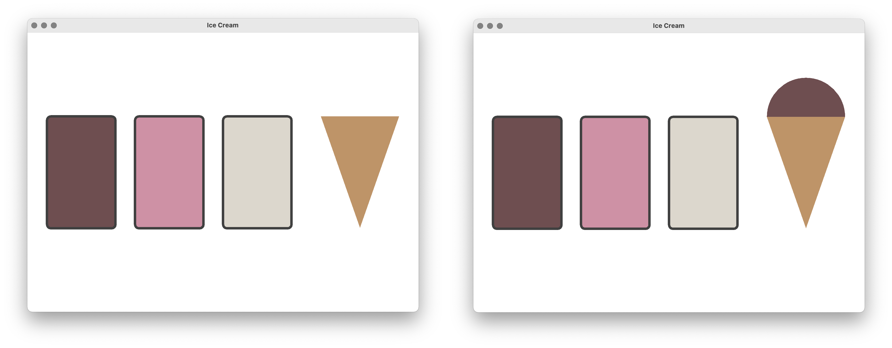

###### _Ponedeljek 23. 8. 2021 ob 12:00 na daljavo preko Zoom_

## 2. pisni izpit pri Programiranje 2 (Praktična matematika)

Čas reševanja pisnega izpita je **120 minut**. Pisni izpit rešujete na lastnih računalnikih doma, dočim pa morate biti celoten čas izpita **vidni preko kamere**! Dovoljena je uporaba poljubnega gradiva, literature, spletnih virov ter zapiskov in rešitev iz predavanj ali vaj. **Prepovedana je kakršnakoli komunikacija** v realnem času!

Pisni izpit je sestavljen iz **štirih enakovrednih nalog**. Prvi dve nalogi zahtevata rešitev v **programskem jeziku [Python 3](https://www.python.org/downloads/release/python-370/)**, zadnji dve nalogi pa zahteva rešitev v **programskem jeziku [Java 8](https://www.oracle.com/technetwork/java/javase/overview/java8-2100321.html)**. Sestavljeni programi ne smejo uporabljati modulov, ki niso skladni s programskim jezikom Python 3, oziroma knjižnic, ki niso del programskega jezika Java 8.

Vso **gradivo potrebno za reševanje nalog** je dostopno na [spletni učilnici](https://ucilnica.fmf.uni-lj.si/course/view.php?id=130). Sestavljene **programe oddate na spletni učilnici** kot je zavedeno v razdelkih <span style="color:gray">_**Kaj in kako oddam?**_</span>. Pazite, da se natančno držite navodil oddaje! 

-

### 1. Mednarodni odnosi v devetdesetih ($\approx$15 vrstic Python kode)

Na naslovu [https://lovro.lpt.fri.uni-lj.si/api/cow](https://lovro.lpt.fri.uni-lj.si/api/cow) je podana datoteka s **podatki o mednarodnih odnosih v devetdesetih** zbranih v okviru projekta _Correlates of War_. Podatki so podani v obliki enostavnega neusmerjenega **grafa v Pajek formatu**. Pri tem **vozlišča grafa ustrezajo** posameznim **narodom** oziroma državam, dočim **povezave ponazarjajo** različne **odnose** med narodi (npr. zavezništva, vojne itd.). 

Vsebino datoteke si lahko ogledate v poljubnem urejevalniku besedil, dočim je del vsebine prikazan spodaj. Prvi del datoteke vsebuje **seznam identifikatorjev vozlišč** z njihovimi oznakami (npr. `1 "AFG"`), drugi del pa **seznam povezav med vozlišči** predstavljenimi z njihovimi identifikatorji (npr. `35 3`). Pazite, da se identifikatorji vozlišč pričnejo z `1` in ne z `0`.

```py
*vertices 106
1 "AFG" # Afghanistan
2 "ALB" # Albania
...
*edges 147
35 3
68 3
...
```

Vaša naloga je, da v programskem jeziku Python 3 sestavite **program**, ki s pomočjo knjižnice `requests` **prebere vsebino datoteke** in za vsak narod **izračuna skupno število odnosov z drugimi narodi** (tj. stopnja pripadajočega vozlišča v grafu). Program naj **končni rezultat zapiše v datoteko** `cow.txt`, ki naj za vsak narod vsebuje oznako naroda in skupno število odnosov. Vrstice **uredite padajoče** glede na število odnosov.

Prvih par vrstic pričakovane vsebine datoteke `cow.txt` je podanih spodaj.

```sh
YUG	24
RUS	21
IRQ	14
USA	13
CHN	8
...
```

###### _Kaj in kako oddam?_

Sestavljen program shranite v **datoteko** `cow.py`, ki jo **oddate na** [spletni učilnici](https://ucilnica.fmf.uni-lj.si/course/view.php?id=130). Ni potrebno oddajati datoteke `cow.txt`, poleg tega se ne pričakuje, da je programska koda opremljena s komentarji. Pazite pa, da program ne vsebuje napak, kar pomeni, da se ukaz `python cow.py` uspešno izvede!

-

### 2. Ustvarjanje zrnatih slik ($\approx$10 vrstic Python kode)

Na naslovu [https://lovro.lpt.fri.uni-lj.si/pro2/exams/painting.png](https://lovro.lpt.fri.uni-lj.si/pro2/exams/painting.png) je dostopna **rastrska slika** v formatu PNG, ki jo najprej prenesite na lasten računalnik. Vaša naloga je, da v programskem jeziku Python 3 sestavite **program**, ki **ustvari zrnato sliko**.

Sliko **razdelite na kvadrate velikosti 4x4 piksle** začenši v zgornjem levem oglišču, pri čimer lahko predpostavite, da sta širina in višina slike deljivi s 4. Nato za vsak kvadrat **vseh 16 pikslov nastavite na "povprečno" barvo** pripadajočih 16 pikslov v izvorni sliki `painting.png`. "Povprečno" barvo izračunajte tako, da vse tri barvne komponente enostavno povprečite (npr. rdeča komponenta "povprečne" barve je povprečje rdečih komponent pripadajočih 16 pikslov v izvorni sliki). Končno **zrnato sliko shranite v datoteko** `granular.png` v formatu PNG.

Pričakovan izgled zrnate slike je prikazan spodaj desno.


Priporoča se, da **kot osnovo** za razvoj **uporabite spodnji program**.

```py
import matplotlib.image as im
img = im.imread('painting.png')
...
im.imsave('granular.png', img)
```

###### _Kaj in kako oddam?_

Sestavljen program shranite v **datoteko** `granular.py`, ki jo **oddate na** [spletni učilnici](https://ucilnica.fmf.uni-lj.si/course/view.php?id=130). Ni potrebno oddajati datotek `painting.png` in `granular.png`, poleg tega se ne pričakuje, da je programska koda opremljena s komentarji. Pazite pa, da program ne vsebuje napak, kar pomeni, da se ukaz `python granular.py` uspešno izvede!

-

### 3. Zaprti intervali celih števil ($\approx$30 vrstic Java kode)

V programskem jeziku Java 8 **sestavite razred** `Interval`, ki naj **predstavlja zaprt interval celih števil**. Le-ta naj bo predstavljen s svojo spodnjo in zgornjo mejo (npr. objektni spremenljivki `lower` in `upper`). Razredu dodajte tudi **osnovni konstruktor in funkcijo** `String toString()`, ki vrne nedvoumno predstavitev intervala kot npr. `[2, 7]`. 

Nato razredu `Interval` dodajte še:

+ **objektno funkcijo** `boolean includes(int number)`, ki preveri ali interval vsebuje podano število `number`;
+ **objektno funkcijo** `boolean includes(List<Integer> numbers)`, ki preveri ali interval vsebuje vsa števila v podanem seznamu `numbers`;
+ **objektno funkcijo** `boolean includes(Interval interval)`, ki preveri ali interval vsebuje podan interval `interval`; in 
+ **statično funkcijo** `Interval merge(Interval first, Interval second)`, ki vrne najmanjši interval, ki vsebuje podana dva intervala `first` in `second`.

Delovanje razreda lahko **preizkusite s pomočjo spodnjega programa**, ki ga vključite v metodo `void main(String[] args)` v razredu `Interval`.

```java
Interval interval = new Interval(2, 7);
System.out.println(interval);
System.out.println(interval.includes(4));
System.out.println(interval.includes(Arrays.asList(new Integer[] {3, 4, 5})));
System.out.println(interval.includes(new Interval(-1, 5)));
System.out.println(Interval.merge(interval, new Interval(5, 9)));
```

Pričakovan izpis zgornjega programa je prikazan spodaj.

```sh
[2, 7]
true
true
false
[2, 9]
```
###### _Kaj in kako oddam?_

Sestavljen program shranite v **datoteko** `Interval.java`, ki jo **oddate na** [spletni učilnici](https://ucilnica.fmf.uni-lj.si/course/view.php?id=130). Ne pričakuje se, da je programska koda opremljena s komentarji. Pazite pa, da program ne vsebuje napak, kar pomeni, da se ukaza `javac Interval.java` in `java Interval` uspešno izvedeta!

-

### 4. Kepica sladoleda v kornetu ($\approx$50 vrstic Java kode)

V programskem jeziku Java 8 sestavite **enostaven grafični vmesnik**, ki naj vsebuje zgolj en panel. Le-ta naj bo **namenjen risanju treh banjic sladoleda** različnih okusov (npr. čokolada, jagoda, vanilija) in pa **korneta** z morebitno kepico **sladoleda**.

**Ob pritisku** miškinega gumba **nad banjico sladoleda**, naj se **v kornet doda kepica sladoleda** izbranega okusa. Ob pritisku miškinega gumba **izven banjic sladoleda**, naj se **iz korneta odstrani** morebitna **kepica sladoleda**.

Primera izgleda grafičnega vmesnika sta prikazana spodaj. Pri tem je **izgled grafičnega vmesnika popolnoma poljuben** dokler le-ta zadošča zahtevam naloge.



Priporoča se, da **kot osnovo** za razvoj **uporabite spodnji program**.

```java
public class IceCream {
	
	public static Flavour flavour = Flavour.NONE;

	public static void main(String[] args) {
		JFrame frame = new JFrame("Ice Cream");
		frame.setDefaultCloseOperation(JFrame.EXIT_ON_CLOSE);
		frame.setSize(new Dimension(800, 600));
		frame.setResizable(true);
		
		JPanel panel = new JPanel();
		panel.setBackground(Color.WHITE);
		frame.add(panel);
		
		...
		
		frame.setVisible(true);
	}

}
```
```java
enum Flavour {

	NONE,
	CHOCOLATE,
	STRAWBERRY,
	VANILLA
	
}
```

###### _Kaj in kako oddam?_

Sestavljen program shranite v **datoteko** `IceCream.java`, ki jo **oddate na** [spletni učilnici](https://ucilnica.fmf.uni-lj.si/course/view.php?id=130). Ne pričakuje se, da je programska koda opremljena s komentarji. Pazite pa, da program ne vsebuje napak, kar pomeni, da se ukaza `javac IceCream.java` in `java IceCream` uspešno izvedeta!