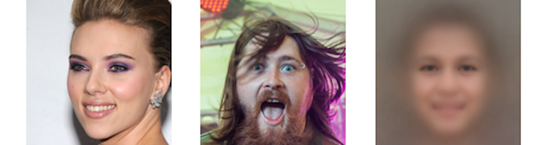
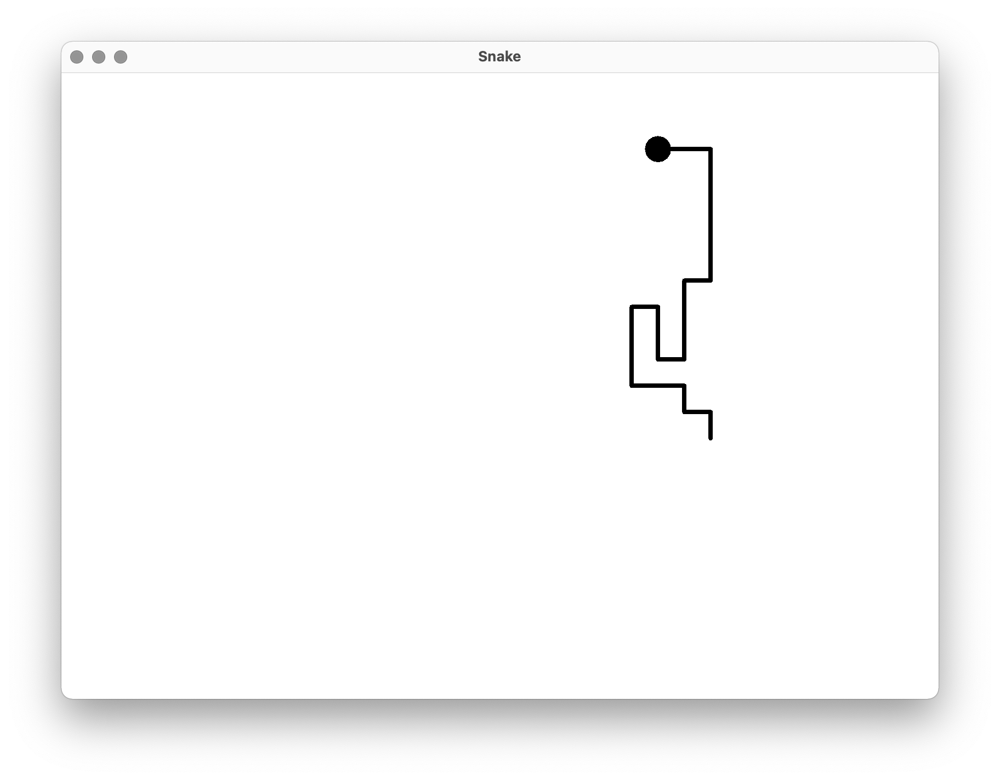

###### _Torek 7. 9. 2021 ob 9:00 na daljavo preko Zoom_

## 3. pisni izpit pri Programiranje 2 (Praktična matematika)

Čas reševanja pisnega izpita je **120 minut**. Pisni izpit rešujete na lastnih računalnikih doma, dočim pa morate biti celoten čas izpita **vidni preko kamere**! Dovoljena je uporaba poljubnega gradiva, literature, spletnih virov ter zapiskov in rešitev iz predavanj ali vaj. **Prepovedana je kakršnakoli komunikacija** v realnem času!

Pisni izpit je sestavljen iz **štirih enakovrednih nalog**. Prvi dve nalogi zahtevata rešitev v **programskem jeziku [Python 3](https://www.python.org/downloads/release/python-370/)**, zadnji dve nalogi pa zahteva rešitev v **programskem jeziku [Java 8](https://www.oracle.com/technetwork/java/javase/overview/java8-2100321.html)**. Sestavljeni programi ne smejo uporabljati modulov, ki niso skladni s programskim jezikom Python 3, oziroma knjižnic, ki niso del programskega jezika Java 8.

Vso **gradivo potrebno za reševanje nalog** je dostopno na [spletni učilnici](https://ucilnica.fmf.uni-lj.si/course/view.php?id=130). Sestavljene **programe oddate na spletni učilnici** kot je zavedeno v razdelkih <span style="color:gray">_**Kaj in kako oddam?**_</span>. Pazite, da se natančno držite navodil oddaje! 

-

### 1. Mačja hiša ($\approx$5 vrstic Python kode)

Na spletni strani [https://www.macjahisa.si/posvojitev/muce](https://www.macjahisa.si/posvojitev/muce) je prikazan **seznam mačk za posvojitev**. Vaša naloga je, da iz vsebine spletne strani **izluščite imena vseh mačk** in jih **izpišete na zaslon** v abecednem vrstnem redu **skupaj s številom** vseh mačk. 

Pri tem pazite, da niza znakov `"Albert"` in `"brezrepa Ester"` predstavljata posamezno mačko, dočim `"Mau in Anubis"` predstavlja dve mački, ki jih obravnavajte ločeno.

Primer izpisa sestavljenega programa je prikazan spodaj.

```sh
84
Adam
Alan
Albert
Alfi
Aneja
Anubis
Ares
Ariana
Barney
...
```

###### _Kaj in kako oddam?_

Sestavljen program shranite v **datoteko** `cats.py`, ki jo **oddate na** [spletni učilnici](https://ucilnica.fmf.uni-lj.si/course/view.php?id=130). Ne pričakuje se, da je programska koda opremljena s komentarji. Pazite pa, da program ne vsebuje napak, kar pomeni, da se ukaz `python faces.py` uspešno izvede!

-

### 2. Povprečen človeški obraz ($\approx$10 vrstic Python kode)

Na naslovu [https://lovro.fri.uni-lj.si/pro2/exams/faces.zip](https://lovro.fri.uni-lj.si/pro2/exams/faces.zip) je dostopna mapa s **1000 rastrskimi slikami** v formatu PNG, ki **prikazujejo človeške obraze**. Vse slike so velikosti 128x128 pikslov, dočim je obraz približno v središču slike. Mapo s slikami si najprej prenesite na lasten računalnik. Nato v programskem jeziku Python 3 sestavite **program**, ki **ustvari "povprečen" človeški obraz**.

"Povprečen" obraz naj bo definiran kot **povprečje vseh 1000 izvornih slik** obrazov. Se pravi, **vsak piksel "povprečnega" obraza nastavite na "povprečno" barvo** pripadajočih 1000 pikslov v izvornih slikah. "Povprečno" barvo izračunajte tako, da vse tri barvne komponente enostavno povprečite (npr. rdeča komponenta "povprečne" barve je povprečje rdečih komponent pripadajočih 1000 pikslov v izvornih slikah). Končni **"povprečni" obraz shranite v datoteko** `face.png` v formatu PNG.

Pričakovan izgled "povprečnega" obraza je prikazan spodaj desno.



###### _Kaj in kako oddam?_

Sestavljen program shranite v **datoteko** `faces.py`, ki jo **oddate na** [spletni učilnici](https://ucilnica.fmf.uni-lj.si/course/view.php?id=130). Ni potrebno oddajati datoteke `face.png`, poleg tega se ne pričakuje, da je programska koda opremljena s komentarji. Pazite pa, da program ne vsebuje napak, kar pomeni, da se ukaz `python faces.py` uspešno izvede!

-

### 3. Polinomi z realnimi koeficienti ($\approx$35 vrstic Java kode)

V programskem jeziku Java 8 **sestavite razred** `Polynomial`, ki naj **predstavlja polinom z realnimi koeficienti**. Le-ta naj bo predstavljen s tabelo koeficientov, začenši s prostim ali vodilnim členom (npr. objektna spremenljivka `double[] coefficients`). Razredu dodajte tudi **osnovni konstruktor in funkcijo** `String toString()`, ki vrne nedvoumno predstavitev polinoma kot npr. `-1.4 * x^2 - 17.9 * x + 3.2`. 

Nato razredu `Polynomial` dodajte še **funkcijo** `double evaluate(double x)`, ki izračuna **vrednost polinoma** pri podanem `x`, in **funkcijo** `Polynomial derivative()`, ki vrne **odvod polinoma**.

Delovanje razreda lahko **preizkusite s pomočjo spodnjega programa**, ki ga vključite v metodo `void main(String[] args)` v razredu `Polynomial`.

```java
Polynomial polynomial = new Polynomial(new double[] { 4.0, 0.0, 2.0, 7.1, -1.3 });
System.out.println(polynomial);
System.out.println(polynomial.derivative());
System.out.println(polynomial.evaluate(1.3));
System.out.println(polynomial.derivative().evaluate(3.1));
```

Pričakovan izpis zgornjega programa je prikazan spodaj.

```sh
-1.3 * x^4 + 7.1 * x^3 + 2.0 * x^2 + 4.0
-5.2 * x^3 + 21.3 * x^2 + 4.0 * x
19.26577
62.1798
```

###### _Kaj in kako oddam?_

Sestavljen program shranite v **datoteko** `Polynomial.java`, ki jo **oddate na** [spletni učilnici](https://ucilnica.fmf.uni-lj.si/course/view.php?id=130). Ne pričakuje se, da je programska koda opremljena s komentarji. Pazite pa, da program ne vsebuje napak, kar pomeni, da se ukaza `javac Polynomial.java` in `java Polynomial` uspešno izvedeta!

-

### 4. Simulacija naključne kače ($\approx$20 vrstic Java kode)

V programskem jeziku Java 8 sestavite **enostaven grafični vmesnik**, ki naj vsebuje zgolj en panel. Le-ta naj bo **namenjen simulaciji kače**, ki se **naključno premika** po ravnini.
Kača naj bo sestavljena iz **24 "členov" dolžine 24 pikslov**. Kačo najpreprosteje predstavite kot seznam točk v ravnini `List<Point> snake`, ki predstavljajo "člene" kače, ter jo izrišete kot lomljeno črto.

Na začetku naj bo kača na poljubni lokaciji (npr. sredini panela). Nato naj se kača **vsakih 100 milisekund premakne za 24 pikslov** v smeri levo, desno, gor ali dol. **Smer premika** naj bo **naključno izbrana**, pri čimer pa **kača ne sme prečkati** sama sebe **ali zapustiti panela**. V primeru, da noben premik ni veljaven, naj se kača ustavi.

Primer izgleda grafičnega vmesnika je prikazan spodaj. Pri tem je **izgled grafičnega vmesnika popolnoma poljuben** dokler le-ta zadošča zahtevam naloge.

<p float="center">
  
</p>

Priporoča se, da **kot osnovo** za razvoj **uporabite spodnji program**.

```java
public class Snake {
	
	public static void main(String[] args) throws InterruptedException {
		JFrame frame = new JFrame("Snake");
		frame.setDefaultCloseOperation(JFrame.EXIT_ON_CLOSE);
		frame.setSize(new Dimension(800, 600));
		frame.setResizable(true);
		
		JPanel panel = new JPanel() {
			@Override
			public void paint(Graphics g) {
				super.paint(g);
				Graphics2D graphics = (Graphics2D)g;
				
				... // izris kače
			}
		};
		panel.setBackground(Color.WHITE);
		frame.add(panel);
```
```java
		frame.setVisible(true);
		
		... // inicializacija kače
		
		while (true) {
			... // premikanje kače

			panel.repaint();

			Thread.sleep(100);
		}
	}

}
```

###### _Kaj in kako oddam?_

Sestavljen program shranite v **datoteko** `Snake.java`, ki jo **oddate na** [spletni učilnici](https://ucilnica.fmf.uni-lj.si/course/view.php?id=130). Ne pričakuje se, da je programska koda opremljena s komentarji. Pazite pa, da program ne vsebuje napak, kar pomeni, da se ukaza `javac Snake.java` in `java Snake` uspešno izvedeta!
